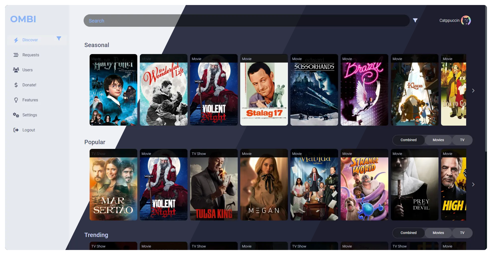
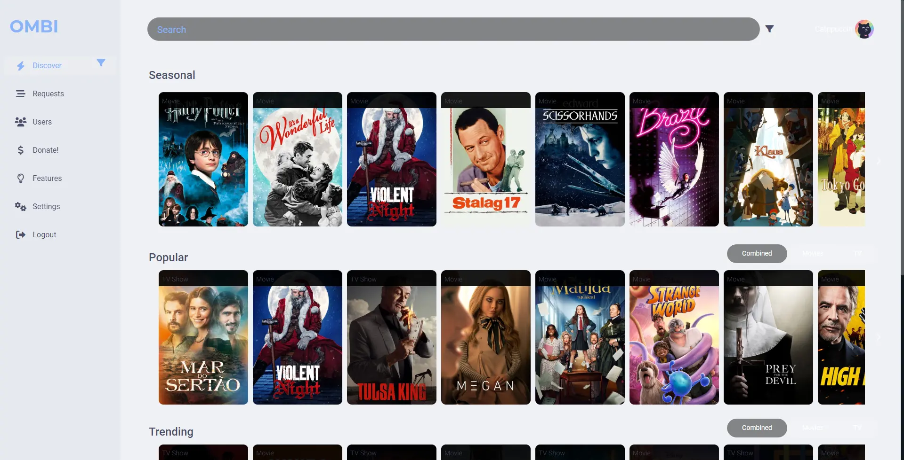
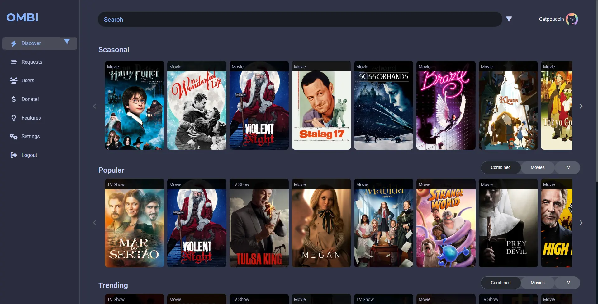
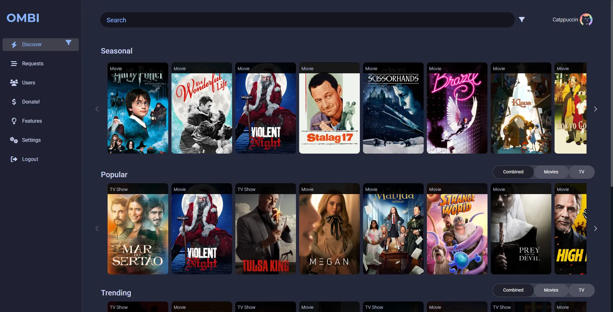
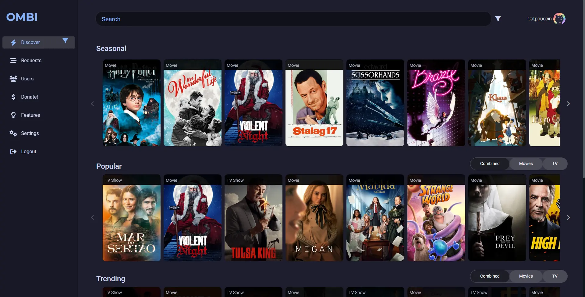

<h3 align="center">
	 
	
	Catppuccin for <a href="https://github.com/gilbn/theme.park">theme.park</a>
	
</h3>

	
	
	

	

## Previews

🌻 Latte

🪴 Frappé

🌺 Macchiato

🌿 Mocha

## Usage

Installing these themes depends on what application you want to apply them to.
We recommend reading [their documentation](https://docs.theme-park.dev/setup)
on how to set up the theme for each app. Besides that, the gist is as follows:

1. Install the **base** theme for the application. On theme.park, the URL would
   be `https://theme-park.dev/css/base/<application>/<application>-base.css`,
   but it depends on your installation method.
2. Install the flavor you prefer, making sure it is loaded after the base.

## 🙋 FAQ

-	Q: **_"Where can I find the docs?"_**\
	A: theme.park has a [very comprehensive documentation
  site](https://docs.theme-park.dev/).
- Q: **_"Latte looks bad! What happened?"_**\
  A: Unfortunately, theme.park itself does not natively support light themes
  and lacks a proper way of implementing them, thus causing Latte to look quite
  bad on most, if not all, applications. There isn't a lot to be fixed here (if
  anything at all), so using a more specific theme is recommended.

## 💝 Thanks to

- [lewisakura](https://github.com/lewisakura)

&nbsp;

	

	Copyright &copy; 2021-present <a href="https://github.com/catppuccin" target="_blank">Catppuccin Org</a>

	

